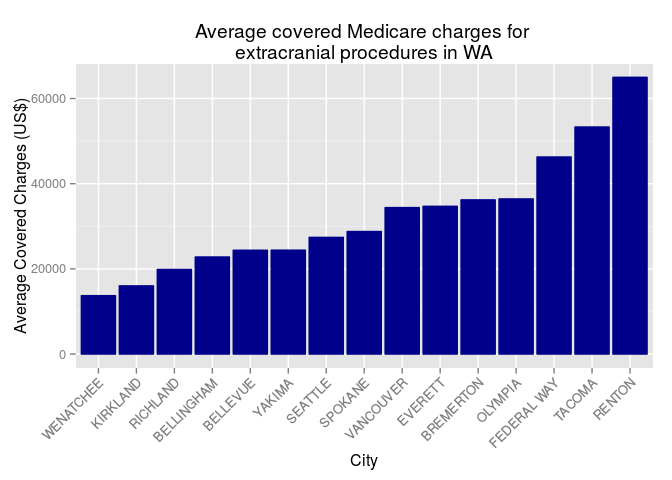

# Average Medicare charge for extracranial procedures
Brian High  
5/4/2015  

Load Packages
-------------

Prepare the environment by loading the required packages.


```r
# Load packages
pkgs <- c("rcurl", "magrittr", "dplyr", "knitr", "ggplot2")
# install.packages(pkgs)       # Uncomment to install the packages if you need to.
invisible(suppressMessages(suppressWarnings(lapply(pkgs, require, character.only=T))))
```

Download the Data
-----------------

This script uses `curl` to download the 
[data file](https://data.cms.gov/Medicare/Inpatient-Prospective-Payment-System-IPPS-Provider/97k6-zzx3) 
from [data.cms.gov](https://data.cms.gov).


```r
file <- "IPPS.csv"
url <- "http://data.cms.gov/api/views/97k6-zzx3/rows.csv?accessType=DOWNLOAD"
if (!file.exists(file)) { 
    download.file(url, file) 
}
```

Read and Subset the Data
------------------------

Read the CSV into a `data.frame` and `subset` by Washington Providers  
with a specific DRG Definition: '039 - EXTRACRANIAL PROCEDURES W/O CC/MCC'. Then
`select` only the columns `Provider.City` and `Average.Covered.Charges`. Lastly, 
rename those columns to something a little shorter for convenience.


```r
ipps <- read.csv("IPPS.csv", header=T, stringsAsFactors=F)
ipps <- subset(ipps, Provider.State=='WA')
ipps <- subset(ipps, DRG.Definition=='039 - EXTRACRANIAL PROCEDURES W/O CC/MCC')
ipps <- select(ipps, Provider.City, Average.Covered.Charges)
colnames(ipps) <- c('City', 'Average.Charge')
```


```r
str(ipps)
```

```
## 'data.frame':	21 obs. of  2 variables:
##  $ City          : chr  "SEATTLE" "YAKIMA" "EVERETT" "WENATCHEE" ...
##  $ Average.Charge: chr  "$16989.61" "$32560.61" "$34694.24" "$13720.90" ...
```

Data Cleanup
------------

The `Average.Charge` has dollar signs and commas which we will remove using 
`sapply` and a custom function `clean_charge`.


```r
clean_charge <- function(charge) {
    as.character(charge) %>% gsub(pattern="[$,]", replacement="") %>% as.numeric
}

ipps$Average.Charge %<>% sapply(clean_charge)
```

Head and Tail
-------------

Now we'll take a look at the first and last lines of the data with `head` 
and `tail`.


```r
head(ipps)
```

```
##           City Average.Charge
## 1022   SEATTLE       16989.61
## 1023    YAKIMA       32560.61
## 1024   EVERETT       34694.24
## 1025 WENATCHEE       13720.90
## 1026   OLYMPIA       35711.18
## 1027   SEATTLE       31339.68
```

```r
tail(ipps)
```

```
##             City Average.Charge
## 1037     SPOKANE       26328.21
## 1038      RENTON       64970.25
## 1039    KIRKLAND       16016.44
## 1040      TACOMA       53322.26
## 1041     OLYMPIA       37158.68
## 1042 FEDERAL WAY       46271.82
```

Aggregate by City
-----------------

Since we have several cities with more than one Provider listed, group by 
`City` and calculate the mean for each group. Then sort by `Average.Charge` 
and apply this order to the `City` as factor levels.


```r
ipps <- aggregate(Average.Charge~City, ipps, mean)
ipps <- arrange(ipps, Average.Charge, City)
ipps$City <- factor(ipps$City, as.character(ipps$City))
```

Nicer Table
-----------

Format the table a little more nicely for our report using `kable`.


```r
kable(ipps, "html")
```

<table>
 <thead>
  <tr>
   <th style="text-align:left;"> City </th>
   <th style="text-align:right;"> Average.Charge </th>
  </tr>
 </thead>
<tbody>
  <tr>
   <td style="text-align:left;"> WENATCHEE </td>
   <td style="text-align:right;"> 13720.90 </td>
  </tr>
  <tr>
   <td style="text-align:left;"> KIRKLAND </td>
   <td style="text-align:right;"> 16016.44 </td>
  </tr>
  <tr>
   <td style="text-align:left;"> RICHLAND </td>
   <td style="text-align:right;"> 19873.24 </td>
  </tr>
  <tr>
   <td style="text-align:left;"> BELLINGHAM </td>
   <td style="text-align:right;"> 22794.33 </td>
  </tr>
  <tr>
   <td style="text-align:left;"> BELLEVUE </td>
   <td style="text-align:right;"> 24376.68 </td>
  </tr>
  <tr>
   <td style="text-align:left;"> YAKIMA </td>
   <td style="text-align:right;"> 24395.11 </td>
  </tr>
  <tr>
   <td style="text-align:left;"> SEATTLE </td>
   <td style="text-align:right;"> 27399.92 </td>
  </tr>
  <tr>
   <td style="text-align:left;"> SPOKANE </td>
   <td style="text-align:right;"> 28777.08 </td>
  </tr>
  <tr>
   <td style="text-align:left;"> VANCOUVER </td>
   <td style="text-align:right;"> 34394.50 </td>
  </tr>
  <tr>
   <td style="text-align:left;"> EVERETT </td>
   <td style="text-align:right;"> 34694.24 </td>
  </tr>
  <tr>
   <td style="text-align:left;"> BREMERTON </td>
   <td style="text-align:right;"> 36202.82 </td>
  </tr>
  <tr>
   <td style="text-align:left;"> OLYMPIA </td>
   <td style="text-align:right;"> 36434.93 </td>
  </tr>
  <tr>
   <td style="text-align:left;"> FEDERAL WAY </td>
   <td style="text-align:right;"> 46271.82 </td>
  </tr>
  <tr>
   <td style="text-align:left;"> TACOMA </td>
   <td style="text-align:right;"> 53322.26 </td>
  </tr>
  <tr>
   <td style="text-align:left;"> RENTON </td>
   <td style="text-align:right;"> 64970.25 </td>
  </tr>
</tbody>
</table>

Bar Plot
--------

Finally, create a bar plot with `ggplot`.


```r
ggplot(ipps, aes(x=City, y=Average.Charge)) +
    geom_bar(stat="identity", colour="black", fill="lightblue") +  
    theme(axis.text.x = element_text(angle = 90, hjust = 1)) + 
    ggtitle("Average covered Medicare charges for \nextracranial procedures in WA") +
    labs(x="City", y="Average Covered Charges (US$)")
```

 
