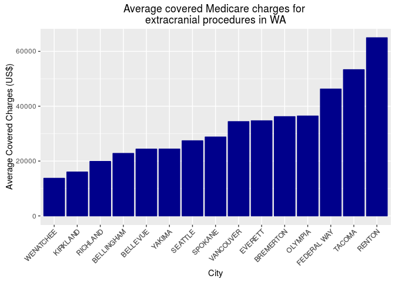

# Average Medicare charge for extracranial procedures
Brian High  
5/4/2015  

Introduction
------------

We are going to investigate the average Medicare charges for 
[extracranial procedures](https://www.cms.gov/icd10manual/fullcode_cms/P0054.html) 
for cities in Washington State, using 
[data](https://data.cms.gov/Medicare/Inpatient-Prospective-Payment-System-IPPS-Provider/97k6-zzx3) from the 
[U.S. Department of Health and Human Services, Centers for Medicare and Medicaid Services](http://www.cms.gov/).

To do so, we will use a dataset hosted and publically shared on the 
UW [SQLShare service using R](http://escience.washington.edu/get-help-now/accessing-sqlshare-r).

This serves as an example of using a single RMarkdown script to access
data from a SQL database, clean it up for analysis, and finally calculate 
some basic statistics and produce a plot. As the code and explanation are 
interwoven into the same executable document, this is an example of 
[literate programming](http://en.wikipedia.org/wiki/Literate_programming).

To reproduce this analysis, you can clone the 
[GitHub repository](https://github.com/brianhigh/medicare-ipps) for this
project into RStudio as a new project and execute the Rmd file with 
"Knit HTML" or Chunks -> Run All.

SQLShare Config
---------------

As this script requires a SQLShare account and API key, check for the 
`config` file. If you don't have one, check the 
[SQLShare website](http://escience.washington.edu/get-help-now/accessing-sqlshare-r) 
for more information on how to create this file.


```r
# Check for sqlshare config file and abort if not found
stopifnot(file.exists("~/.sqlshare/config"))
```

Prepare Environment
-------------------

Prepare the environment by loading the required packages...


```r
pkg_installer <- "./checkallpkgs.R"  # Automatically search and install...
if (file.exists(pkg_installer)) { source(pkg_installer, echo=FALSE) }
```

```
## Loading required package: magrittr
## Loading required package: dplyr
## 
## Attaching package: 'dplyr'
## 
## The following object is masked from 'package:stats':
## 
##     filter
## 
## The following objects are masked from 'package:base':
## 
##     intersect, setdiff, setequal, union
## 
## Loading required package: knitr
## Loading required package: ggplot2
## Loading required package: sqlshare
## Loading required package: RCurl
## Loading required package: bitops
```

```r
# ... or uncomment next line to manually install packages
# install.packages(c("sqlshare", "magrittr", "dplyr", "knitr", "ggplot2"))

# Load packages
pkgs <- c("sqlshare", "magrittr", "dplyr", "knitr", "ggplot2")
invisible(suppressMessages(suppressWarnings(lapply(pkgs, require, character.only=T))))
```

... and setting up `knitr`.


```r
opts_chunk$set(tidy=FALSE, cache=TRUE)
```

Query Database
--------------

Define our query and submit it to the SQLShare service.


```r
# Data source: 
# https://data.cms.gov/Medicare/Inpatient-Prospective-Payment-System-IPPS-Provider/97k6-zzx3
# https://sqlshare.escience.washington.edu/sqlshare/#s=query/high%40washington.edu/IPPS.csv
sql <- "SELECT [Provider City],[Average Covered Charges] 
        FROM [high@washington.edu].[table_IPPS.csv] 
        WHERE [Provider State] = 'WA' 
        AND [DRG Definition] = '039 - EXTRACRANIAL PROCEDURES W/O CC/MCC'"
ipps <- fetch.data.frame(sql)
```

The SQLShare package has returned our data as a `data.frame`. 


```r
str(ipps)
```

```
## 'data.frame':	21 obs. of  2 variables:
##  $ Provider.City          : Factor w/ 15 levels "BELLEVUE","BELLINGHAM",..: 10 15 4 14 7 10 10 2 15 3 ...
##  $ Average.Covered.Charges: Factor w/ 21 levels "$13720.90","$16016.44",..: 4 11 14 1 16 10 12 6 3 17 ...
```

Data Cleanup
------------

The `Average.Covered.Charge` amounts are stored as a factor, not as a number. We 
should fix that, after removing the dollar signs and commas. First, let's rename 
the columns, then use `sapply` and a custom function `clean_charge` to do the 
rest.


```r
colnames(ipps) <- c('City', 'Average.Charge')

clean_charge <- function(charge) {
    as.character(charge) %>% gsub(pattern="[$,]", replacement="") %>% as.numeric
}

ipps$Average.Charge %<>% sapply(clean_charge)
```

Head and Tail
-------------

Now we'll take a look at the first and last lines of the data with `head` 
and `tail`.


```r
head(ipps)
```

```
##        City Average.Charge
## 1   SEATTLE       16989.61
## 2    YAKIMA       32560.61
## 3   EVERETT       34694.24
## 4 WENATCHEE       13720.90
## 5   OLYMPIA       35711.18
## 6   SEATTLE       31339.68
```

```r
tail(ipps)
```

```
##           City Average.Charge
## 16     SPOKANE       26328.21
## 17      RENTON       64970.25
## 18    KIRKLAND       16016.44
## 19      TACOMA       53322.26
## 20     OLYMPIA       37158.68
## 21 FEDERAL WAY       46271.82
```

Aggregate by City
-----------------

Since we have several cities with more than one Provider listed, group by 
`City` and calculate the mean for each group. Then sort by `Average.Charge`, 
making sure to also apply this order to the `City` factor levels.


```r
ipps <- aggregate(Average.Charge~City, ipps, mean)
ipps <- arrange(ipps, Average.Charge, City)
ipps$City <- factor(ipps$City, as.character(ipps$City))
```

Nicer Table
-----------

Format the table a little more nicely for our report using `kable`.


```r
kable(ipps, "html")
```

<table>
 <thead>
  <tr>
   <th style="text-align:left;"> City </th>
   <th style="text-align:right;"> Average.Charge </th>
  </tr>
 </thead>
<tbody>
  <tr>
   <td style="text-align:left;"> WENATCHEE </td>
   <td style="text-align:right;"> 13720.90 </td>
  </tr>
  <tr>
   <td style="text-align:left;"> KIRKLAND </td>
   <td style="text-align:right;"> 16016.44 </td>
  </tr>
  <tr>
   <td style="text-align:left;"> RICHLAND </td>
   <td style="text-align:right;"> 19873.24 </td>
  </tr>
  <tr>
   <td style="text-align:left;"> BELLINGHAM </td>
   <td style="text-align:right;"> 22794.33 </td>
  </tr>
  <tr>
   <td style="text-align:left;"> BELLEVUE </td>
   <td style="text-align:right;"> 24376.68 </td>
  </tr>
  <tr>
   <td style="text-align:left;"> YAKIMA </td>
   <td style="text-align:right;"> 24395.11 </td>
  </tr>
  <tr>
   <td style="text-align:left;"> SEATTLE </td>
   <td style="text-align:right;"> 27399.92 </td>
  </tr>
  <tr>
   <td style="text-align:left;"> SPOKANE </td>
   <td style="text-align:right;"> 28777.08 </td>
  </tr>
  <tr>
   <td style="text-align:left;"> VANCOUVER </td>
   <td style="text-align:right;"> 34394.50 </td>
  </tr>
  <tr>
   <td style="text-align:left;"> EVERETT </td>
   <td style="text-align:right;"> 34694.24 </td>
  </tr>
  <tr>
   <td style="text-align:left;"> BREMERTON </td>
   <td style="text-align:right;"> 36202.82 </td>
  </tr>
  <tr>
   <td style="text-align:left;"> OLYMPIA </td>
   <td style="text-align:right;"> 36434.93 </td>
  </tr>
  <tr>
   <td style="text-align:left;"> FEDERAL WAY </td>
   <td style="text-align:right;"> 46271.82 </td>
  </tr>
  <tr>
   <td style="text-align:left;"> TACOMA </td>
   <td style="text-align:right;"> 53322.26 </td>
  </tr>
  <tr>
   <td style="text-align:left;"> RENTON </td>
   <td style="text-align:right;"> 64970.25 </td>
  </tr>
</tbody>
</table>

Bar Plot
--------

Finally, create a bar plot with `ggplot`.


```r
ggplot(ipps, aes(x=City, y=Average.Charge)) +
    geom_bar(stat="identity", colour="black", fill="lightblue") +  
    theme(axis.text.x = element_text(angle = 90, hjust = 1)) + 
    ggtitle("Average covered Medicare charges for \nextracranial procedures in WA") +
    labs(x="City", y="Average Covered Charges (US$)")
```

 
